# 🚀 AI-Powered CRM with Intelligent Sales Assistant

<div align="center">


**A next-generation CRM that functions as a real-time AI assistant for sales professionals**

[🎯 Features](#-core-ai-features) • [🏗️ Architecture](#-system-architecture) • [🤖 AI Implementation](#-ai--rag-implementation) • [🚀 Quick Start](#-quick-start) • [📊 Demo](#-interactive-demo)

</div>

---

## 📋 Table of Contents

- [🎯 Core AI Features](#-core-ai-features)
- [🏗️ System Architecture](#-system-architecture)
- [🤖 AI & RAG Implementation](#-ai--rag-implementation)
- [🗄️ Vector Database Integration](#️-vector-database-integration)
- [🔄 Data Flow & Processing](#-data-flow--processing)
- [💻 Technology Stack](#-technology-stack)
- [🚀 Quick Start](#-quick-start)
- [📊 Interactive Demo](#-interactive-demo)
- [🔒 Security & Privacy](#-security--privacy)
- [📈 Performance & Scalability](#-performance--scalability)
- [🧪 Testing](#-testing)
- [📚 API Documentation](#-api-documentation)
- [🤝 Contributing](#-contributing)

---

## 🎯 Core AI Features

Our AI-powered CRM transforms traditional sales processes with four intelligent modules that provide real-time, contextual assistance:

### 🧠 1. Deal Coach AI
**Intelligent Deal Progression Assistant**

The Deal Coach AI analyzes your deals and provides actionable next steps based on:
- **Historical Deal Patterns**: Leverages similar successful deals from your database
- **Stage-Specific Logic**: Tailored suggestions based on current deal stage
- **Time-Based Triggers**: Identifies stagnant deals and suggests re-engagement strategies
- **Value-Based Prioritization**: Higher-value deals receive more sophisticated coaching

**Key Capabilities:**
- ✅ Analyzes deal metadata, past interactions, and objection patterns
- ✅ Provides 2-3 prioritized action items with confidence scores
- ✅ Uses RAG to retrieve top 5 most similar historical successful deals
- ✅ Considers industry match (40%), deal size (30%), and objection type (30%)

**Example Output:**
```
🎯 HIGH PRIORITY: Schedule decision-maker call
   Confidence: 85% | Based on 3 similar $50K+ deals
   
⏰ MEDIUM: Send detailed ROI proposal
   Confidence: 72% | 2 similar deals closed after ROI presentation
   
📞 LOW: Follow up on technical questions
   Confidence: 65% | Standard follow-up for this stage
```

### 👤 2. Customer Persona Builder
**AI-Powered Behavioral Analysis**

Automatically generates comprehensive customer profiles by analyzing:
- **Communication Patterns**: Formal vs. casual, response times, preferred channels
- **Decision-Making Style**: Analytical vs. intuitive, solo vs. committee-based
- **Objection Patterns**: Price-focused, feature-focused, or timeline-focused
- **Engagement Levels**: High, medium, or low responsiveness

**Intelligence Features:**
- 🔄 **Auto-Updates**: Refreshes after every 3 new interactions
- 🎯 **Contextual Insights**: Tailors communication recommendations
- 📊 **Behavioral Scoring**: Quantifies engagement and buying signals
- 🔍 **Pattern Recognition**: Identifies similar customer archetypes

### 🛡️ 3. Objection Handler
**Smart Response Generation System**

Provides intelligent, contextual responses to customer objections:
- **Multi-Angle Approach**: Logical, emotional, and social proof strategies
- **Tone Matching**: Adapts to customer's communication style
- **Context Awareness**: Considers deal stage, customer persona, and objection history
- **Follow-up Integration**: Includes conversation-continuing questions

**Response Strategy Framework:**
1. **Acknowledge** the concern professionally
2. **Address** with 2-3 different approach angles
3. **Advance** the conversation with strategic questions

### 📊 4. Win/Loss Explainer
**Deal Outcome Analysis Engine**

Provides comprehensive analysis of closed deals to improve future performance:
- **Timeline Analysis**: Compares deal duration to industry averages
- **Objection Impact**: Analyzes how objections affected the outcome
- **Stakeholder Engagement**: Evaluates decision-maker involvement
- **Competitive Factors**: Identifies competitive advantages/disadvantages

---

## 🏗️ System Architecture


---

## 🤖 AI & RAG Implementation

### 🧠 Retrieval-Augmented Generation (RAG) Architecture

Our RAG implementation enhances AI responses with contextual historical data:


### 🔍 Vector Database Strategy

**ChromaDB Collections:**

1. **`historical_deals`** - Deal Coach Context
   - Stores: Deal outcomes, timelines, objections, industry data
   - Similarity Factors: Industry (40%), Deal Size (30%), Objection Type (30%)
   - Time Limit: Last 12 months only

2. **`objection_responses`** - Objection Handler Context
   - Stores: Successful objection handling patterns
   - Metadata: Objection category, resolution success rate, industry

3. **`customer_interactions`** - Persona Builder Context
   - Stores: Communication patterns, response behaviors
   - Analysis: Tone, frequency, engagement levels

4. **`customer_personas`** - Persona Patterns
   - Stores: Behavioral profiles and traits
   - Matching: Similar personality patterns and decision-making styles

### 🎯 Context Retrieval Logic

```javascript
// Example: Deal Coach RAG Query
const dealContext = {
  industry: "SaaS",
  dealValue: 50000,
  stage: "proposal",
  objections: ["price", "timeline"],
  duration: 45 // days
};

// Vector search with weighted similarity
const similarDeals = await vectorService.searchSimilar('deals', dealContext, 5, {
  industry: dealContext.industry,
  outcome: 'closed_won',
  value: { $gte: dealContext.dealValue * 0.5, $lte: dealContext.dealValue * 2 }
});

// AI prompt with RAG context
const prompt = `
Based on these similar successful deals:
${similarDeals.map(deal => deal.summary).join('\n')}

Provide 3 actionable suggestions for current deal:
Industry: ${dealContext.industry}
Value: $${dealContext.dealValue}
Stage: ${dealContext.stage}
`;
```

### 🛡️ Content Filtering & Safety

**Multi-Layer Content Security:**

1. **Input Sanitization**: DOMPurify for XSS prevention
2. **Content Classification**: Inappropriate content detection
3. **Business Context Validation**: Ensures professional sales context
4. **Rate Limiting**: 500 AI requests per user per day
5. **Audit Logging**: Complete request/response tracking

---

## 🗄️ Vector Database Integration

### 📊 Embedding Generation Process

```mermaid
flowchart TD
    A[New CRM Data] --> B{Data Type?}
    
    B -->|Deal Closed| C[Extract Deal Context]
    B -->|Objection Resolved| D[Extract Objection Pattern]
    B -->|Interaction Logged| E[Extract Communication Pattern]
    
    C --> F[Generate Deal Summary]
    D --> G[Generate Objection Summary]
    E --> H[Generate Interaction Summary]
    
    F --> I[OpenAI Embedding API]
    G --> I
    H --> I
    
    I --> J[1536-dim Vector]
    
    J --> K{Store in ChromaDB}
    
    K --> L[historical_deals Collection]
    K --> M[objection_responses Collection]
    K --> N[customer_interactions Collection]
    
    L --> O[Available for Deal Coach]
    M --> P[Available for Objection Handler]
    N --> Q[Available for Persona Builder]
    
    style A fill:#e3f2fd
    style I fill:#fff3e0
    style K fill:#f3e5f5
```



### 🔄 Real-time Indexing Pipeline

**Automatic Data Indexing:**
- **Trigger Events**: Deal closure, objection resolution, interaction logging
- **Batch Processing**: 10 records per batch to optimize performance
- **Incremental Updates**: Only new/modified data is re-indexed
- **Background Processing**: Non-blocking indexing operations

**Index Optimization:**
```javascript
// Automatic reindexing on data changes
class RAGIndexingService {
  async handleDataUpdate(modelType, documentId, action = 'update') {
    switch (modelType) {
      case 'Deal':
        if (action === 'closed') {
          await this.reindexDeal(documentId);
        }
        break;
      case 'Objection':
        if (action === 'resolved') {
          await this.reindexObjection(documentId);
        }
        break;
      case 'Interaction':
        await this.reindexInteraction(documentId);
        break;
    }
  }
}
```

---

## 🔄 Data Flow & Processing

### 📈 AI Request Processing Pipeline


### 🎯 Confidence Scoring Algorithm

```javascript
calculateConfidence(response, ragContext = []) {
  let confidence = 50; // Base confidence
  
  // RAG context quality
  if (ragContext.length >= 3) confidence += 20;
  if (ragContext.some(ctx => ctx.similarity > 0.8)) confidence += 15;
  
  // Response characteristics
  if (response.includes('specific') || response.includes('based on')) confidence += 10;
  if (response.length > 100 && response.length < 300) confidence += 5;
  
  // Historical accuracy (if available)
  const historicalAccuracy = this.getHistoricalAccuracy(feature);
  confidence = Math.round(confidence * (historicalAccuracy / 100));
  
  return Math.min(Math.max(confidence, 10), 95); // Cap between 10-95%
}
```

---

## 💻 Technology Stack

### 🎨 Frontend Architecture
```
Next.js 15.3.3 (React 19)
├── 🎨 Styling: Tailwind CSS + ShadCN UI
├── 🔄 State Management: React Hooks + Context
├── 📱 Responsive Design: Mobile-first approach
├── 🌙 Theme Support: Dark/Light mode toggle
├── ⚡ Performance: Turbopack for fast builds
└── 🎭 Animations: Framer Motion + CSS transitions
```

### ⚙️ Backend Architecture
```
Node.js 18+ (Express.js)
├── 🗄️ Database: MongoDB with Mongoose ODM
├── 🤖 AI Integration: OpenAI GPT-4 + Embeddings API
├── 🔍 Vector Database: ChromaDB for RAG
├── 🔐 Authentication: JWT with bcrypt
├── 🛡️ Security: Helmet, CORS, Rate Limiting
├── 📝 Logging: Winston with structured logs
├── ✅ Validation: Express-validator + Joi
└── 🧪 Testing: Jest + Supertest
```

### 🤖 AI & ML Stack
```
OpenAI Integration
├── 🧠 Language Model: GPT-4 (gpt-4)
├── 📊 Embeddings: text-embedding-3-small (1536 dimensions)
├── 🎯 Temperature: 0.7 for balanced creativity/consistency
├── 📏 Token Limits: 400 tokens for suggestions, 800 for analysis
└── 💰 Cost Optimization: Response caching + rate limiting
```

### 🗄️ Data Architecture
```
Data Layer
├── 📊 Primary Database: MongoDB
│   ├── Users, Contacts, Deals, Interactions
│   ├── AI Logs, Sessions, Objections
│   └── Indexes on userId, dealId, timestamps
├── 🔍 Vector Database: ChromaDB
│   ├── 4 Collections (deals, objections, interactions, personas)
│   ├── Cosine similarity search
│   └── Metadata filtering
└── ⚡ Caching: In-memory cache (15min TTL)
```

---

## 🚀 Quick Start

### 📋 Prerequisites

```bash
# Required versions
Node.js >= 18.0.0
MongoDB >= 5.0
Python >= 3.8 (for ChromaDB)
```

### 🔧 Installation

1. **Clone the repository**
```bash
git clone https://github.com/your-org/ai-powered-crm.git
cd ai-powered-crm
```

2. **Setup Backend**
```bash
cd backend
npm install

# Environment configuration
cp .env.example .env
# Add your OpenAI API key and MongoDB connection string
```

3. **Setup Frontend**
```bash
cd ../frontend
npm install
```

4. **Setup ChromaDB**
```bash
# Install ChromaDB
pip install chromadb

# Start ChromaDB server
chroma run --host localhost --port 8000
```

5. **Environment Variables**
```bash
# Backend .env
OPENAI_API_KEY=your_openai_api_key
MONGODB_URI=mongodb://localhost:27017/crm_ai
CHROMA_URL=http://localhost:8000
JWT_SECRET=your_jwt_secret
NODE_ENV=development
AI_REQUESTS_PER_DAY=500

# Frontend .env.local
NEXT_PUBLIC_API_URL=http://localhost:3001
```

### 🚀 Running the Application

```bash
# Terminal 1: Start ChromaDB
chroma run --host localhost --port 8000

# Terminal 2: Start Backend
cd backend
npm run dev

# Terminal 3: Start Frontend
cd frontend
npm run dev
```

**Access the application:**
- Frontend: http://localhost:3000
- Backend API: http://localhost:3001
- ChromaDB: http://localhost:8000

### 📊 Initial Data Setup

```bash
# Seed database with sample data
cd backend
npm run seed

# Index existing data for RAG
curl -X POST http://localhost:3001/api/admin/index-data
```

---

## 📊 Interactive Demo

### 🎮 Try the AI Features

**1. Deal Coach Demo:**
```bash
# Create a sample deal
curl -X POST http://localhost:3001/api/deals \
  -H "Content-Type: application/json" \
  -H "Authorization: Bearer YOUR_JWT_TOKEN" \
  -d '{
    "title": "Enterprise SaaS Deal",
    "value": 50000,
    "stage": "proposal",
    "contactId": "CONTACT_ID"
  }'

# Get AI coaching suggestions
curl -X GET http://localhost:3001/api/deals/DEAL_ID/coach \
  -H "Authorization: Bearer YOUR_JWT_TOKEN"
```

**2. Objection Handler Demo:**
```bash
# Handle a price objection
curl -X POST http://localhost:3001/api/objections/handle \
  -H "Content-Type: application/json" \
  -H "Authorization: Bearer YOUR_JWT_TOKEN" \
  -d '{
    "objectionText": "Your solution is too expensive for our budget",
    "dealId": "DEAL_ID",
    "category": "price",
    "severity": "high"
  }'
```

### 📈 Sample AI Responses

**Deal Coach Response:**
```json
{
  "success": true,
  "data": {
    "suggestions": [
      {
        "action": "Schedule decision-maker call",
        "priority": "high",
        "confidence": 85,
        "reasoning": "Based on 3 similar $50K+ deals that closed after executive involvement"
      },
      {
        "action": "Send detailed ROI analysis",
        "priority": "medium", 
        "confidence": 72,
        "reasoning": "2 similar deals in your industry closed after ROI presentation"
      }
    ],
    "ragContext": [
      {
        "similarity": 0.89,
        "industry": "SaaS",
        "outcome": "closed_won",
        "value": 45000
      }
    ]
  }
}
```

---

## 🔒 Security & Privacy

### 🛡️ Security Measures

**Authentication & Authorization:**
- JWT-based authentication with secure token storage
- Password hashing using bcryptjs (12 rounds)
- Session management with automatic expiration
- Role-based access control (planned for v2.0)

**API Security:**
- Rate limiting: 500 AI requests per user per day
- Input validation and sanitization
- CORS configuration for cross-origin requests
- Helmet.js for security headers
- Request/response logging for audit trails

**Data Protection:**
- Content filtering for inappropriate inputs
- PII data handling with MongoDB encryption
- Secure API key management
- Regular security audits and updates

**AI Safety:**
- Content moderation for all AI inputs/outputs
- Prompt injection prevention
- Response filtering and validation
- Usage monitoring and anomaly detection

### 🔐 Privacy Compliance

**Data Handling:**
- Minimal data collection principle
- User consent for AI processing
- Data retention policies (2 years for interactions)
- Soft delete with 30-day recovery window
- Export functionality for data portability

---

## 📈 Performance & Scalability

### ⚡ Performance Optimizations

**Frontend Performance:**
- Next.js 15 with Turbopack for fast builds
- Component lazy loading and code splitting
- Image optimization and caching
- Service worker for offline functionality
- Bundle size optimization (< 500KB gzipped)

**Backend Performance:**
- Response caching (15-minute TTL)
- Database query optimization with indexes
- Connection pooling for MongoDB
- Batch processing for vector operations
- Background job processing for indexing

**AI Performance:**
- Response caching to reduce API calls
- Batch embedding generation
- Vector search optimization
- Token usage optimization
- Fallback responses for API failures

### 📊 Scalability Architecture

**Horizontal Scaling:**
- Stateless API design for load balancing
- Database sharding strategies
- CDN integration for static assets
- Microservices architecture (planned)
- Container orchestration with Docker

**Monitoring & Analytics:**
- Real-time performance monitoring
- AI usage analytics and cost tracking
- Error tracking and alerting
- User behavior analytics
- System health dashboards

---

## 🧪 Testing

### 🔬 Test Coverage

**Backend Testing:**
```bash
# Run all tests
npm test

# Run with coverage
npm run test:coverage

# Watch mode for development
npm run test:watch
```

**Test Categories:**
- **Unit Tests**: Individual function testing (85% coverage)
- **Integration Tests**: API endpoint testing
- **AI Service Tests**: Mock OpenAI responses
- **Database Tests**: MongoDB operations
- **Security Tests**: Input validation and sanitization

**Frontend Testing:**
```bash
# Component testing with React Testing Library
npm run test:components

# E2E testing with Playwright
npm run test:e2e
```

### 📊 Test Results

```
Test Suites: 45 passed, 45 total
Tests:       312 passed, 312 total
Coverage:    85.2% statements, 82.1% branches
Time:        45.2s
```

---

## 📚 API Documentation

### 🔗 Core Endpoints

**Authentication:**
```
POST /api/auth/login     - User login
POST /api/auth/register  - User registration
POST /api/auth/refresh   - Token refresh
DELETE /api/auth/logout  - User logout
```

**AI Features:**
```
GET    /api/deals/:id/coach           - Get deal coaching suggestions
POST   /api/objections/handle         - Handle customer objections
GET    /api/contacts/:id/persona      - Get customer persona analysis
POST   /api/deals/:id/win-loss        - Analyze deal outcome
POST   /api/ai/feedback               - Submit AI feedback
```

**CRM Operations:**
```
GET    /api/deals                     - List deals with filters
POST   /api/deals                     - Create new deal
PUT    /api/deals/:id                 - Update deal
DELETE /api/deals/:id                 - Delete deal

GET    /api/contacts                  - List contacts
POST   /api/contacts                  - Create contact
PUT    /api/contacts/:id              - Update contact
```

**Analytics:**
```
GET    /api/analytics/dashboard       - Dashboard metrics
GET    /api/analytics/ai-usage        - AI usage statistics
GET    /api/analytics/performance     - Performance metrics
```

### 📖 Detailed API Documentation

Full API documentation with examples, request/response schemas, and authentication details is available at:
- **Swagger UI**: http://localhost:3001/api-docs (when running locally)
- **Postman Collection**: [Download Collection](./docs/postman-collection.json)

---

## 🤝 Contributing

### 🛠️ Development Setup

1. **Fork the repository**
2. **Create a feature branch**
```bash
git checkout -b feature/amazing-feature
```

3. **Make your changes**
4. **Add tests for new functionality**
5. **Run the test suite**
```bash
npm test
```

6. **Commit your changes**
```bash
git commit -m "Add amazing feature"
```

7. **Push to your branch**
```bash
git push origin feature/amazing-feature
```

8. **Open a Pull Request**

### 📝 Contribution Guidelines

**Code Standards:**
- Follow ESLint and Prettier configurations
- Write comprehensive tests for new features
- Update documentation for API changes
- Use conventional commit messages
- Maintain backward compatibility

**AI Feature Development:**
- Test with multiple scenarios and edge cases
- Implement proper error handling and fallbacks
- Add content filtering for new AI inputs
- Update RAG indexing for new data types
- Monitor token usage and costs

### 🐛 Bug Reports

Please use the [GitHub Issues](https://github.com/your-org/ai-powered-crm/issues) page to report bugs. Include:
- Detailed description of the issue
- Steps to reproduce
- Expected vs actual behavior
- Environment details (OS, Node version, etc.)
- Screenshots or logs if applicable

---

## 📄 License

This project is licensed under the MIT License - see the [LICENSE](LICENSE) file for details.

---

## 🙏 Acknowledgments

- **OpenAI** for providing the GPT-4 and Embeddings APIs
- **ChromaDB** for the excellent vector database solution
- **Next.js Team** for the amazing React framework
- **MongoDB** for the flexible document database
- **ShadCN** for the beautiful UI components
- **Vercel** for deployment and hosting solutions

---

## 📞 Support

- **Documentation**: [Full Documentation](./docs/README.md)
- **Issues**: [GitHub Issues](https://github.com/your-org/ai-powered-crm/issues)
- **Discussions**: [GitHub Discussions](https://github.com/your-org/ai-powered-crm/discussions)
- **Email**: support@your-crm-domain.com

---

<div align="center">

**Built with ❤️ by the AI CRM Team**

[](https://github.com/your-org/ai-powered-crm/stargazers)
[](https://github.com/your-org/ai-powered-crm/network/members)
[](https://github.com/your-org/ai-powered-crm/issues)

</div>